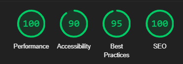

# Web pro lektorování ve Step It Academy

Tyto stránky byly vytvořené, pro vyučování v Step It academy. Je ze spousty učavy použitá pro vyučování dětí v oblasti IT. Veškeré lekce budou sepsané níže tak samo jako použité technologie při vývoji webu. 
Kažá lekce má určitý počet lekcí a na každé lekce si každý studen vytvoří **Závěrečnou prácí** z daného témata. A poté každý student odprezentuje před svími rodiči.


## Technologie
- HTML & CSS, Boostrap
- Javascript, JQuery
- Google Analytics
- Construct-3
- AVIF pro obrázky

## Broken links checker
- K naleznutí rozbytých či nefunkčínch linků na web stránce. Se používá tento file [broken-links.py](scripty-sprava-webu/broken-links/broken-links.py). Ten po spuštění vygeneruje stránky a ta se následně zobrazí [zde](/bugs.html)

- Více informací v [README](scripty-sprava-webu/broken-links/README.md) této aplikace.

## AVIF konverze

Ke konverzi obrazků na .avif stačí [GIMP](https://www.gimp.org/). A při použití funkce export jde obraze vyexportovat na .avif fomát. Formát podporují všecny nejpoužívanější vyhledávače. Enge pouze od verze 121.xx.


## Google Analytics

Google analytic využíváme ke sledování dění na webových stránkách. [WEBove rozhrani](https://analytics.google.com/analytics/web/#/p411707114/reports/reportinghub?params=_u..nav%3Dmaui&collectionId=business-objectives)

- Pokud je potřeba vytvořit novou stránku stačí přidat do head tagu v html dokumentu.

 ``` html
 <script async src="https://www.googletagmanager.com/gtag/js?id=G-4XPWG9HLN2"></script>
  <script>
    window.dataLayer = window.dataLayer || [];
    function gtag() { dataLayer.push(arguments); }
    gtag('js', new Date());

    gtag('config', 'G-4XPWG9HLN2');
  </script>
 ```

## Google Analytics

Tato technologie je stále v rozmýšlení. Při poslední pokusu o zprovoznění tedy dne 16/10/2023. Bylo schválení zamítnuto z důvodu nedostatečného kontentu.

## Google ligthouse

Tato vyhytávka se skvěle hodní na nalezení chybějících věcí na webové stránce. Při vytvoření nové webové stránky, stránka projde kontrolou. Průměrný výsledek jde videt níže.
<figure style="text-align: center;">

<figcaption markdown="2">
</figcaption>
</figure>

## ToDo List
- General
    - Vylepšní pdf pro domácí úkoly, z wordu nejlepe predelat vymyslet lepsi zpracovani
    - uprava novych obrazku na avif format
    - vytvorit scrypt pro konverzi uobrazku do avif formy, vytvorit k tomu readme
    - pridat tlacitka dropdown tak ze budou rozdelene podle tematickych okruhu, treba dropdown lekce -> okruhy -> jednotlive lekce
    - pridat stranku kde se bude zobrazovat z markdownu jednotlive updaty
    - updaty predelat v hlavniho readme do readme bokem
    - stranka Mystat, kontakt -> spatne navigacni menu
    - popremyslet o prepsani tohot webu do reactu nebo angularu
    
    
- Art of presentation
    - zkusit udelat neco jako type war, abych omezil tolik externich odkazů
    
- Audacity
    - Opravit popisky k lekcim
    - lekce 2 pridat ukazku fazovace, zrychleni tempa, orezat ticho
    - pridat zkratky v audacity
    - pridat jak ulozit hudbu v mp3
     
- Roblox
    - pridani obrazku k strance env
    - pridani obrazku k strnace lua
    - pridani obrazku k strance lekce 1, pridat datum pridani robloxu na windows 2006
    - pridani obrazku k strance lekce 2
    - pridani ukazku jak upravovat teren je to tlacitko Editor, a pote zalozka create se da vygenerovat teren, a v zalozce Edit je mozna editace terenu
    - pridani ukazky jak na kolaboraci mezi lidmi na jednom projektu
    - oprava scirptu na lekci 1
    - lekce 1 pridat ukazkovou hru
    - lekce 2 pridat ukazkovou hru
    - Lekce 3 - dodelat obsah
    - pridat stranku jak na kolaboraci, tkj spolu práci mezi vice lidmi na jednom projektu
    - lekce 3 vytvorit vkladani dalsich obrazku z roblox studia, musi to byt ve tvaru rbxassetid:// + ID toho obrázku
    - zmena pohledu osoby - starterplayer => Camera => cameramode == LockFirstPerson
    - [ ] Lekce 4 - samostatna prace
    - hodnoceni lekce
    
    
- Html & CSS
    - pridat nejake ukazkove video do lekce 4
    - pridat pisnicky do kolece 4 jako ukazku
    - zkontrolovat jestli se nekde na webu objevuje jak udelat podtrzeny text
    - zkusit pridat vice informaci do lekce, vice zajimavych tagu, uprav pomoci css

- TinkerCad
    - vylepsit html a css kod, udelat responsivni stranky cele lekce
    - upravit uvodni stranku, tlacitka, popisky
    - u projeku schovat zadani pro posledni skupinu
    - pridat aspon 2 bonusove ukoly
    - udelat prehlednejsi k nalezeni bonusovych ukolu

- Python Beginer
    - lekce 6 obsah, zkontrolovat obsah
    - lekce 5, upravit ukol aby byl zajimavejsi + rozsirit to o pokracovani o seznamu

- Python Minecraft minetest
    - lekce 1 - dodelat rozpracovane chybi screeny
    - projekt
    - vytvorit scripty aby splnovali zadani samostatnych praci
    

- Construct 3
    - [ ] pridat ukazku chovani flash na space shooter
    - upravit uvodni stranku tak aby byla vice prehlednejsi
 

# Versions

## 2024 June - Update
- Python Minecraft minetest
    - lekce 1 - obsah
    - lekce 1 - pridat seznam bloku z odkazu https://github.com/sprintingkiwi/pycraft_lib/blob/master/pycraft_minetest/blocklist.py
    - lekce 1 - upravit prikazy tak aby odpovidali, prideleni prav, nastanevi dne a zastaveni casu
    - lekce 2 - obsah
    - lekce 2 - pridat propojeni na lekci python beginer kde jsou používané věci popsané více 
    - lekce 3 - obsah
    - Pridat hodnoceni lekce
    - lekce 4 - obsah
    - pridat tlkacika pro posouvani mezi lekcemi
    - lekce 5 - obsah

## 2024 May - Update

- Html & CSS
    - Pridani navodu jak udelat publish webu na githubu
    - pridat nejakou hru k otestovaní znalostí z html a css, neco ve stylu na tabuli se zobrazi ukol se zadáním a poté nechám čas a v pořadím jakém se přihlásí tak v takovém budou dostavat body celkem se rozdelí 10 diamantu mezi top 4 - 5 žáků
        -   úkoly: zkusit udělat větší množství úkolů
            - tučný text
            - funkční odkaz na google.com
            - tlačítko
            - seznam s tečky
            - seznam s čísli
            - největší nadpis
            - nejmenší nadpis v modé barvě
            - text kurzivou
            - obrazek o šířce 300px
            - odkaz bez formatovaní, černý
            - rozdělení řádku na 2 řádky (br)
            - červený text
            - tabulka

- Python Beginer
    - lekce 5 obsah, ukol
    - lekce 4 zmenit ukazkovy obrazek
    - Projekt

- Python Minecraft python
    - vytvoreni lekce a stranek

## 2024 April - Update
- General
    - Vylepšení rozvržení hlavních stránek lekci, vytvoření sekcí 
     ``` html
        <section>
            text goes here
        </section>
    ```
    - Upravit vzhled talcitek, zacit pouzivat vice boostrap
        - zatim vytvoreno pro art of presentation
    
- Html & CSS
    - lekce 3 obsah, ukol, procist a opravit prekliky
    - lekce 2 ukolu upravit aby v zadani mohli pracovat i o hre, zamyslet se o obsahu tabulky
    - lekce 1 pridat ukázku na třidu
    - pridat vice ukazek pouziti k lekci 1
    - hodnoceni lekce
    - lekce 3 opravit vytvareni dalsich souboru a pridat popis k adresari
    - lekce 4 obsah, ukol
    - lekce 5 obsah, ukol
    - projekt
    - pridani ukazku zakladni tagu
        - strong
        - b
        - big
        - br
        - hr
        - i
        - small
    - pridani ukazky stinu textu => textíshadow: 0 1px 1px black

- Python Beginer
    - lekce 2 obsah, ukol
    - lekce 3 obsah, ukol
    - lekce 4 obsah, ukol
    - hodnoceni lekce

Roblox
    - Lekce 4 - obsah
    - pridani ukazky jak zmenit barvu pomoci scriptu, nize ukazka nastavi objekt na cervenou barvu
        ``` lua
        local platform = script.Parent
        platform.BrickColor = BrickColor.Red()
        ```
    -  Projekt word a pdf

- Art of presentation
    - Vytvořit ukol č. 5
    - pridani ukazky praci k ukoluvm ve forme pdf, aby to nemohli kopirova

## 2024 March - Update
- Html & CSS
    - lekce 1 obsah, ukol
    - lekce 2 obsah, ukol
    - Aktualizovat IDE ktere se bude pouzivat, pouzivat se bude VSC, a extensiony na html a css a prote live server
- Python Beginer
    - lekce 1 obsah - upravý text, upravý text k vyvojovemu prostredi, úkol č. 1, formátovaný tisk
- Závěrečná prezentace
    - opravit tak aby byla více k pochopení, trochu mate a dost nevystihuje co mají děti udělat

## 2024 February - Update
- Roblox
    - Přidání na stránky přeskakove tlacika mimo lekce
    - Přidání pár obrázku pro stránky env
    - Vytvoření lekce 2
    - Vytvoření Lekce 3
    - Vytvoření Lekce 4
- Art of presentation
    - Lekce 2 změnění "ty naleznete zde" na tlačítko, tak aby to bylo lépe poznat, kde návŠtěvníci najdou hry
    - Velepšení vzhledu talačítek
    - Uprava responzivního texu na úvodní straně lekce
    - Přidání tlačítka na stažení zadání úkolu a projektu
    - Oprava správného zobrazení tabulky na strance projekt.html
- Youtube
    - pridat popisky obsahu k uvodu cele lekce

## 2024 January - Update
- Roblox
    - Vytvoření env, kde se popisují základní vlastnosti v Roblox studiu
    - Vytvoreni stranky o jazyku LUA a jeho základní syntaxe
    - Vytvoření obsahu lekce 1, spolu i vytvořené výsledné skripty
    - Projekt web stranka
- General
    - Úprava dokumentace k webu
    - Vytvoření stánky kde budou zobrazeny updaty webovek
    - Upravit nove pridane fotky na avif format
    - opravit broken links
    - vytvoření ikony webu
    - Přidat na stranky 
        ```html
        <meta name="description" content="popis stranky">
        ```
- Audacity
    - pridani ukazky metadat na prvni lekci
    - pridani k ukolum a samostatných pracích pozadavek na metadata, tak jako v projektu zvukova kolaz
    - upravit nadpisi lekci na Lekce 1 - co se bude dit
    - oprava lekce 1 a klikaci odpovedi
- Youtube
    - Lekce 3 - obsah
    - Lekce 4 - obsah
- Python Beginer
    - změmit Pycharm na vsc   
- TinkerCad
    - Oprava formatovani obrazku
    - Přidat popisky k obrázkům
- Arf of presentation
    - Oprava textu na poslední lekci
    - optimalni velikost nadpisu a text

    

## 1/18/2024 - Update
- Google analytic 
    - [x] zprovozneni google analytic, pro monitorovani traficku na webovce
- Stranka pro prezentaci 
    - [x] vytvorit odkaz na hlavní stránce
    - [x] vytvorit pdf a word verzi pro ukoly
    - [x] upravit rozlozeni textu
- Youtube
    - [x] lekce 1
    - [x] lekce 2
    - [x] Lekce 5
    - [x] Projekt
    - [x] Upravit ukoly přidat informace
    - [x] Upravit poradí samostatných prací
    - [x] vytovření úkolů
- Construct
    - [x] lekce 3
    - [x] lekce 4
    - [x] lekce 5
    - [x] Lekce 6
    - [x] Lekce 7
    - [x] odevzdani du
    - [x] popsani prostredi constructu
    - [x] ukaždé prace přidat i ukázkovou práci
    - [x] přidání obrázky animace do lekce 2
    - [x] vytvoření stránky pro nejlepší projekty
    - [x] pridani k hram otevirani v dalsim okne
- TinkerCad
    - [x] přidání času a tlačítka na přeskakování mezi lekci
    - [x] uprava uvodni stranky
    - [x] vytvoření přehledu kde bude název skupiny a odkaz na přihlášení 
    - [x] Vytvoření zadání pro projekt, pdf a word, odkaz na stazeni zdani na stranku projektu
    - [x] projekt ZOO, random 3 zvirata z tohoto seznamu, ty zpracuji a vytvori zoo
    - [x] upravit nadpis lekce 1, 2, 3, 4, 5
    - [x] pridat odkaz na stranku tinkercadu na kazdou lekci a stranku projektuja-th-o-10-23
    - [x] vytvoreni skupiny na tinkercad + pristupove udaje ja-th-o-10-23
    - [x] pridani jedne bonusove prace
    - [x] uprava lekce 1
    - [x] smazat hodnocení ukolů
- Arf of presentation
    - [x] Lekce 1 - obsah
    - [x] Lekce 1 - kontrast barvy textu na strance
    - [x] Lekce 1 - samostatna prace
    - [x] Lekce 2 - samostatna prace
    - [x] Hodnoceni projektu
    - [x] Lekce 2 - obsah
    - [x] Lekce 3 - obsah
    - [x] Lekce 3 - samostatna prace
    - [x] Lekce 4 - obsah
    - [x] Lekce 4 - samostatna prace
    - [x] Projekt, word verze i pdf
    - [x] Rozdělení obrázku do složek podle lekce
    - [x] Vytvoření tabulky hodnoceni na strance projektu 
- Youtube
    - [x] novy projekt + prezentace
    - [x] oprava odkazu na strance projektu
    - [x] pridani stazeni coveru
- Python
    - [x] Prejmenovani na python_beginner
- General
    - [x] Opravit linky po zmene nazvu html stranek v tinkercad lekci
    - [x] Vytvořit footer
    - [x] Upravit obrázky, chyba je ve velikosti obrázků a rozměrech, kouknout na formaty AVIF nebo WebP
    - [x] Oprava obrazku kvuli ruznych prohlizecu Edge to nebere
    - [x] Sjednoceni navbaru, tak aby nikde nechybeli lekce
    - [x] Klikaci odkaz na nadpisi lekce, hodnoceni, projek a prezentace v prehledu lekce
        - [x] Arf of presentation
        - [x] Audacity
        - [x] Youtube
        - [x] TinkerCad
        - [x] Construct
        - [x] Roblox
        - [x] HTML and CSS
        - [x] Wordpress
        - [x] Javascript
        - [x] Python Beginer
